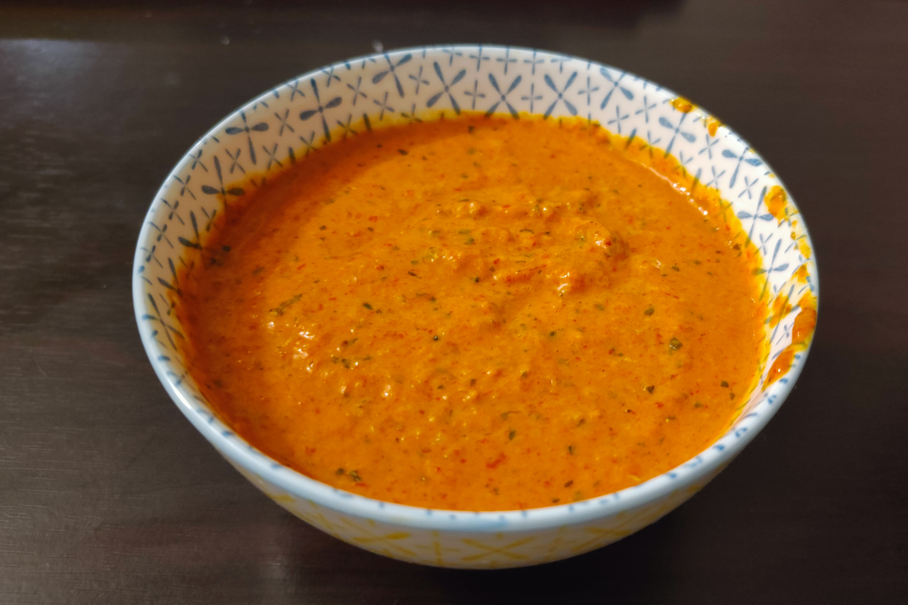
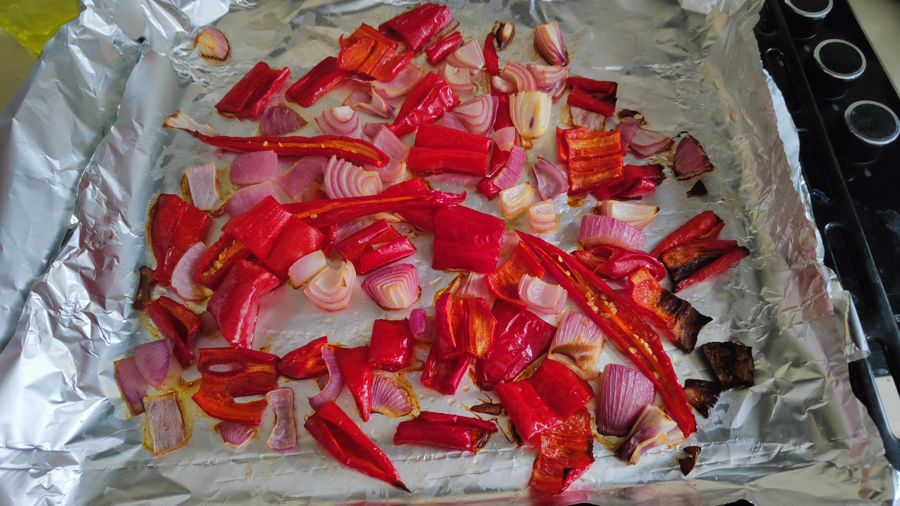
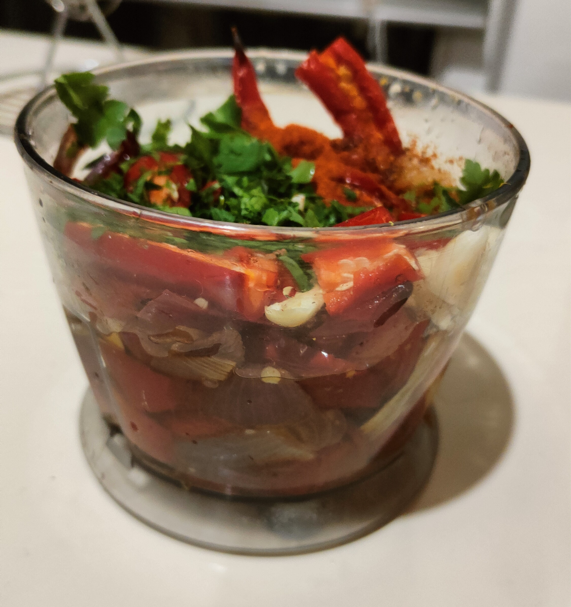
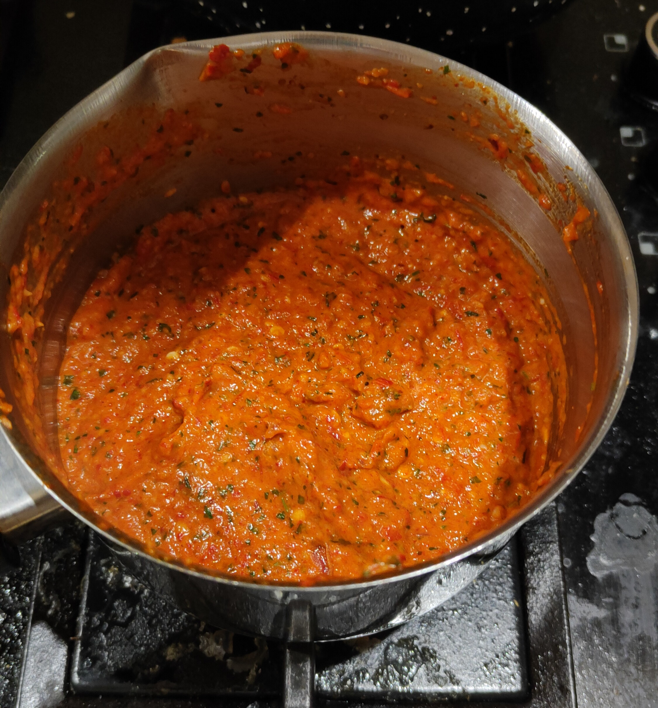

# Пряный соус Пири-Пири

И начинаем мы с давно увиденного мной в тиктоке рецепта соуса Peri Peri. Не знаю, как он правильно называется на русском, но родом он из африки и делается на основе перца чили. 
Ради этого соуса я специально купил красный лук и оливковое.

# Что нужно
- 🫑2-4 болгарских перца
- 🌶 2-4 красных чили, в зависимости от желаемой остроты
- 🧅1 красный лук
- 🍋1 лимон
- 1 пучок петрушки
- 🧄8 зубчиков чеснока
- 1 ст. ложка копченой паприки
- Оливковое масло для жарки
- Винный уксус, хотя мне кажется можно взять и яблочный

# Как делать
Болгарский перец, чили и лук режем крупно и запекаем в духовке минут 40 при 180.

Затем, добавьте в чашу блендера чеснок, петрушку, уксус, лимонную цедру и сок, копченую паприку. Посыпьте солью с перцем. Сверху оливковое масло и уксус и овощи из духовки. По рецепту полагается еще класть свежий чили, но тут смотрите сами 🌶

Блендерим всё это безобразие минут 5-10 в зависимости от вашего терпения. 
Дальше тонкий момент. Кажется, автор протёр соус через сито и я поступил также. Других объяснений, как он получил такую консистенцию, у меня нет. Этот муторный момент, в принципе, можно пропустить, но лучше не надо.
Минут 20 кипятим соус на минимальном огне, постоянно помешивая.

Пробиваем блендером еще раз. Всё готово!

# Что в итоге
Соус получился пряный и довольно острый. Ушло довольно много сил и я перепачкал просто всю посуду на кухне. По соотношению силы/вкус вышло не очень. В целом, мне понравилось, но делать часто я его не буду.

Подписывайтесь на мой [телеграм-канал с едой](https://t.me/boiledjija), там будет еще много рецептов!